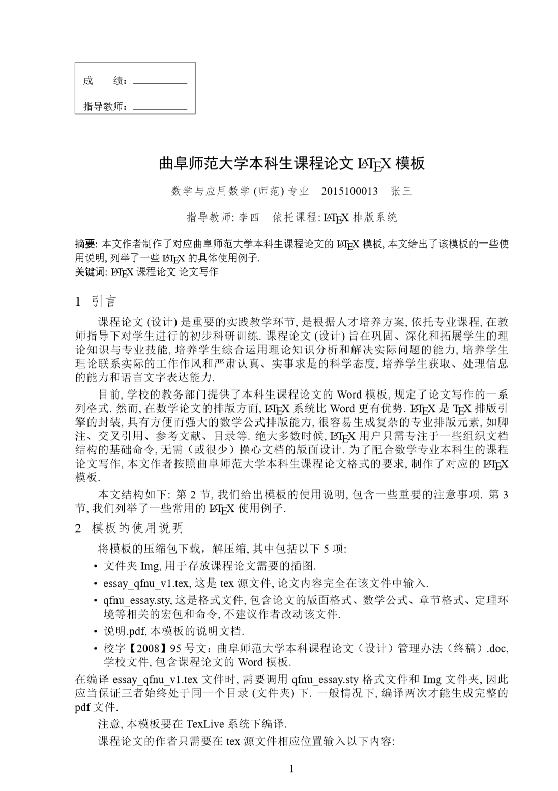

# 曲师大本科生课程论文 (理科) LaTeX 模板

## 预览



## 简介

这是一份符合曲阜师范大学本科生课程论文(理科)格式要求的简单优雅的 LaTeX 模板 

## 快速开始

> 假定你已安装配置完成 [TeXLive](https://www.cnblogs.com/sunfenglong/p/11336644.html) 环境，并且熟悉 LaTeX 排版系统

- Step1：下载解压模板 *Clone or download*
- Step2：修改Tex目录下的论文信息与章节内容
- Step3：双击运行 `build.bat` 脚本生成最终的 pdf 文件

> *注意：
> - 运行 `build.bat` 脚本后生成的 pdf 文件在 Temp 目录下。
> - LaTeX 小白可参考[《一份（不太）简短的LaTeX2ε介绍》](http://mirrors.sjtug.sjtu.edu.cn/ctan/info/lshort/chinese/lshort-zh-cn.pdf)


## 文件说明

```
│  build.bat //编译脚本（Windows）
│  build.sh //编译脚本（Linux/macOS）
│  README.md  //模板使用说明
│  Essay.tex //论文主体
├─Docs //一些说明文档
├─Img //此处存放论文中用到的图片资源
│      qfnu.pdf //曲阜师范大学（矢量图）
│      qfnu_logo.pdf  //曲师大校徽（矢量图）
├─Style //文档样式
│      custom.sty //自定义命令放在此处
│      qfnuessay.sty //主要文档样式设置
└─Tex //注意，一般你只需修改此目录下的文件内容
    │  qfnu.tex //论文主框架
    └─chapter //此处存放论文各章节内容
```

>*注意：
> - Tex 与 Img 目录是你的主要工作区，一般无需改动其他目录文件，除非你清楚的知晓自己在做什么，会有什么后果。
> - 如需手动编译 `Essay.tex` ，请使用 `XeLaTeX` 连续编译两次，以确保交叉引用生效。

## 鸣谢

本模板是在 [曲阜师范大学 LaTeX 模板(孙奉龙)](https://www.cnblogs.com/sunfenglong/p/11349006.html) 与 [国科大学位论文 LaTeX 模板(莫晃锐
)](https://github.com/mohuangrui/ucasessay) 的基础上二次修改而来的，没有他们就没有本模板，非常感谢。

